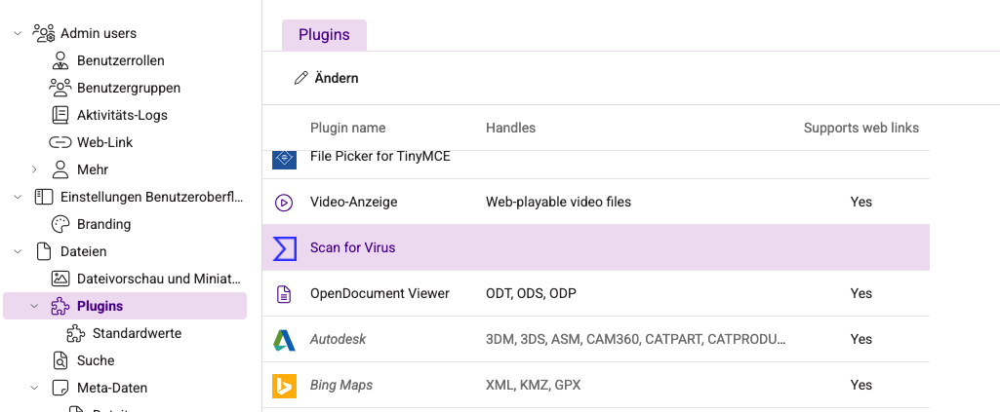
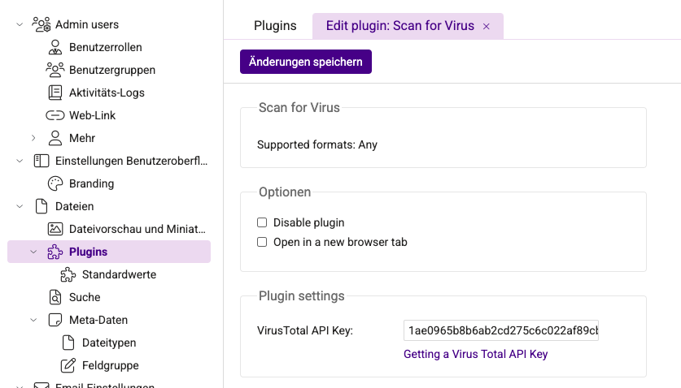
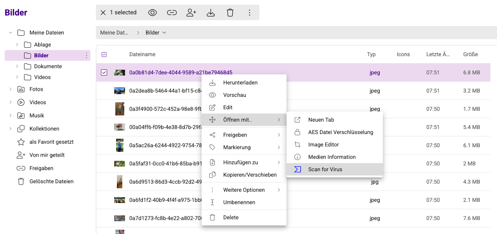
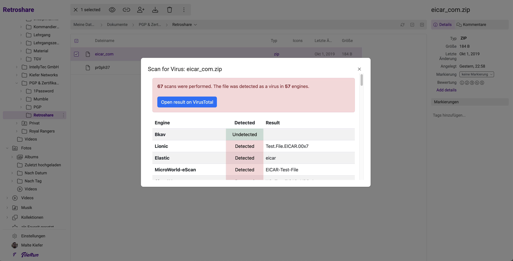

# filerun-plugin-virustotal
filerun-plugin-virustotal is an extension for the file manager [filerun](https://filerun.com/).
With this extension you have the possibility to check files for a virus at VirusTotal with one click.

## Screenshots

## Installation

1. Change to the filerun directory
2. Run the following command `cd customizables/plugins`
3. Run the following command: `git clone https://github.com/MalteKiefer/filerun-plugin-virustotal virustotal`
> **Important:** the directory must have the name `virustotal`, otherwise you will get an error.
4. Go to the plugins setting and add your VirusTotal API key

## Thanks
- [IzzySoft](https://github.com/IzzySoft/virustotal) for the VirusTotal PHP Class

